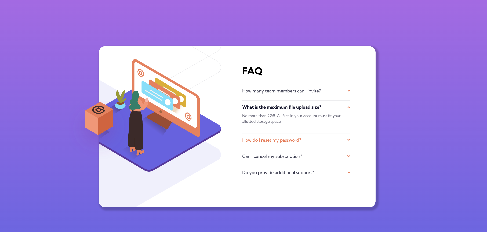
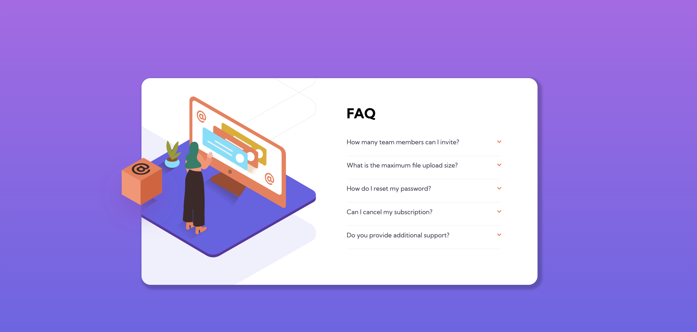
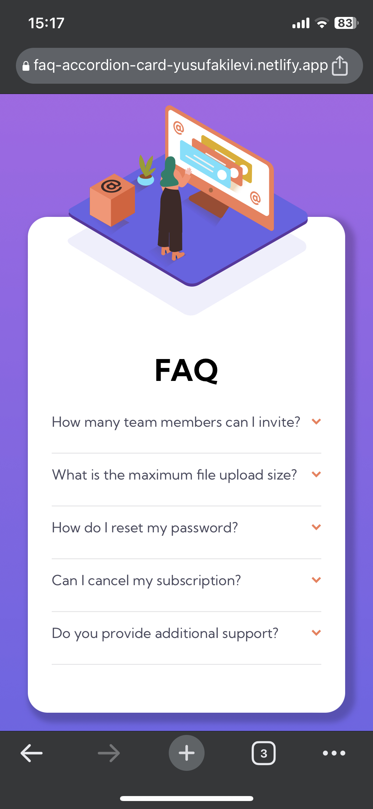
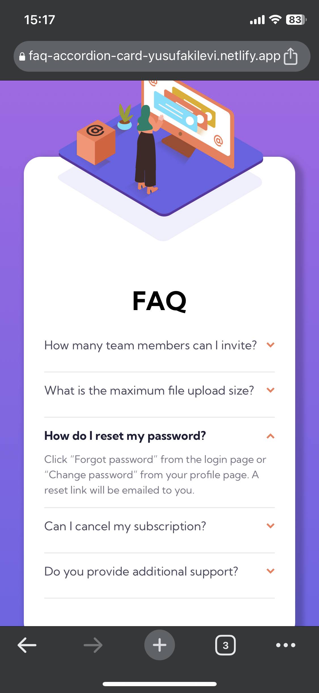

# Frontend Mentor - FAQ accordion card solution

This is a solution to the [FAQ accordion card challenge on Frontend Mentor](https://www.frontendmentor.io/challenges/faq-accordion-card-XlyjD0Oam). Frontend Mentor challenges help you improve your coding skills by building realistic projects.

## Table of contents

- [Overview](#overview)
  - [The challenge](#the-challenge)
  - [Screenshot](#screenshot)
  - [Links](#links)
- [My process](#my-process)
  - [Built with](#built-with)
  - [What I learned](#what-i-learned)
  - [Useful resources](#useful-resources)
- [Author](#author)
- [Acknowledgments](#acknowledgments)

## Overview

### The challenge

Users should be able to:

- View the optimal layout for the component depending on their device's screen size
- See hover states for all interactive elements on the page
- Hide/Show the answer to a question when the question is clicked

### Screenshot






### Links

- Solution URL: [https://github.com/YusufAkilevi/FAQ-Accordion-Card-Frontend-Mentor](https://github.com/YusufAkilevi/FAQ-Accordion-Card-Frontend-Mentor)
- Live Site URL: [https://faq-accordion-card-yusufakilevi.netlify.app/](https://faq-accordion-card-yusufakilevi.netlify.app/)

## My process

### Built with

- Semantic HTML5 markup
- CSS custom properties
- Flexbox
- CSS Grid
- Desktop-first workflow
- JavaScript

### What I learned

I learned about background-position property in CSS to place the background pattern in the project. Here is how i wrote in CSS:

```css
.illustration-box {
  background: url("./images/bg-pattern-desktop.svg");
  background-position: -50.2rem -27.7rem;
  background-size: 225%;
  background-repeat: no-repeat;
  position: relative;
  overflow: hidden;
}
```

I also review the event delegation concept in JavaScript to delegate the click event to the questions. Here is the code:

```js
questionsContainer.addEventListener("click", function (e) {
  const target = e.target;
  if (!target) return;

  if (target.classList.contains("question")) {
    const openQ = document.querySelector(".open");
    if (openQ && openQ.parentElement !== target.parentElement) {
      document
        .querySelector(".question-open")
        .classList.remove("question-open");
      openQ.classList.remove("open");
    }

    if (openQ && openQ.parentElement === target.parentElement) {
      document
        .querySelector(".question-open")
        .classList.remove("question-open");

      openQ.classList.remove("open");
      return;
    }
    target.classList.add("question-open");
    target.nextElementSibling.classList.add("open");
  }
});
```

### Useful resources

- [MDN](https://developer.mozilla.org/en-US/) - This helped me to find anything related Javascript, CSS or HTMl.
- [CSS Tricks](https://css-tricks.com/) - This website explains css properties really easy to understand and provide example codes.

## Author

- Frontend Mentor - [@YusufAkilevi](https://www.frontendmentor.io/profile/YusufAkilevi)
- Twitter - [@yusufakilevii](https://twitter.com/yusufakilevii)
- GitHub - [@YusufAkilevi](https://github.com/YusufAkilevi)

## Acknowledgments

I worked alone in this project and I hope I would have an opportunity to work on an open source project with other developers.
